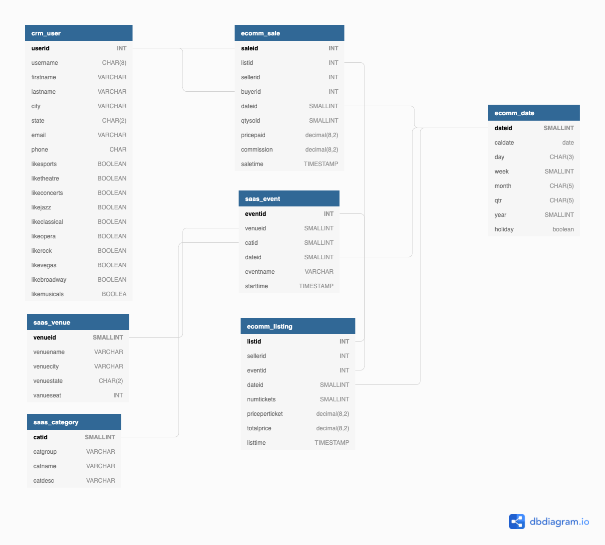

# demo-data

This repo hosts the [Tickit demo database](https://docs.aws.amazon.com/redshift/latest/dg/c_sampledb.html) from AWS Redshift.

[ER Diagram](https://dbdiagram.io/d/61c399533205b45b73c97fcd)

## Table Information
### Category
| Column name 	| Data type   	| Description                                                                                                                      	|
|-------------	|-------------	|----------------------------------------------------------------------------------------------------------------------------------	|
| CATID       	| SMALLINT    	| Primary key, a unique ID value for each row. Each row represents a specific type of event for which tickets are bought and sold. 	|
| CATGROUP    	| VARCHAR(10) 	| Descriptive name for a group of events, such as `Shows` and `Sports`.                                                            	|
| CATNAME     	| VARCHAR(10) 	| Short descriptive name for a type of event within a group, such as `Opera` and `Musicals`.                                       	|
| CATDESC     	| VARCHAR(30) 	| Longer descriptive name for the type of event, such as `Musical theatre`.                                                        	|

### Event
| Column name 	| Data type    	| Description                                                                                                                                	|
|------------:	|--------------	|--------------------------------------------------------------------------------------------------------------------------------------------	|
| EVENTID     	| INTEGER      	| Primary key, a unique ID value for each row. Each row represents a separate event that takes place at a specific venue at a specific time. 	|
| VENUEID     	| SMALLINT     	| Foreign-key reference to the VENUE table.                                                                                                  	|
| CATID       	| SMALLINT     	| Foreign-key reference to the CATEGORY table.                                                                                               	|
| DATEID      	| SMALLINT     	| Foreign-key reference to the DATE table.                                                                                                   	|
| EVENTNAME   	| VARCHAR(200) 	| Name of the event, such as `Hamlet` or `La Traviata`.                                                                                      	|
| STARTTIME   	| TIMESTAMP    	| Full date and start time for the event, such as `2008-10-10 19:30:00`.                                                                     	|

### Venue
| Column name 	| Data type    	| Description                                                                                                                                            	|
|------------:	|--------------	|--------------------------------------------------------------------------------------------------------------------------------------------------------	|
| VENUEID     	| SMALLINT     	| Primary key, a unique ID value for each row. Each row represents a specific venue where events take place.                                             	|
| VENUENAME   	| VARCHAR(100) 	| Exact name of the venue, such as `Cleveland Browns Stadium`.                                                                                           	|
| VENUECITY   	| VARCHAR(30)  	| City name, such as `Cleveland`.                                                                                                                        	|
| VENUESTATE  	| CHAR(2)      	| Two-letter state or province abbreviation (United States and Canada), such as `OH`.                                                                    	|
| VENUESEATS  	| INTEGER      	| Maximum number of seats available at the venue, if known, such as `73200`. For demonstration purposes, this column contains some null values and zeroes. 	|

### Listing
|    Column name 	| Data type    	| Description                                                                                                            	|
|---------------:	|--------------	|------------------------------------------------------------------------------------------------------------------------	|
| LISTID         	| INTEGER      	| Primary key, a unique ID value for each row. Each row represents a listing of a batch of tickets for a specific event. 	|
| SELLERID       	| INTEGER      	| Foreign-key reference to the USERS table, identifying the user who is selling the tickets.                             	|
| EVENTID        	| INTEGER      	| Foreign-key reference to the EVENT table.                                                                              	|
| DATEID         	| SMALLINT     	| Foreign-key reference to the DATE table.                                                                               	|
| NUMTICKETS     	| SMALLINT     	| The number of tickets available for sale, such as 2 or 20.                                                             	|
| PRICEPERTICKET 	| DECIMAL(8,2) 	| The fixed price of an individual ticket, such as 27.00 or 206.00.                                                      	|
| TOTALPRICE     	| DECIMAL(8,2) 	| The total price for this listing (NUMTICKETS*PRICEPERTICKET).                                                          	|
| LISTTIME       	| TIMESTAMP    	| The full date and time when the listing was posted, such as 2008-03-18 07:19:35.                                       	|

### Sales
| Column name 	| Data type    	| Description                                                                                                                                            	|
|------------:	|--------------	|--------------------------------------------------------------------------------------------------------------------------------------------------------	|
| SALESID     	| INTEGER      	| Primary key, a unique ID value for each row. Each row represents a sale of one or more tickets for a specific event, as offered in a specific listing. 	|
| LISTID      	| INTEGER      	| Foreign-key reference to the LISTING table.                                                                                                            	|
| SELLERID    	| INTEGER      	| Foreign-key reference to the USERS table (the user who sold the tickets).                                                                              	|
| BUYERID     	| INTEGER      	| Foreign-key reference to the USERS table (the user who bought the tickets).                                                                            	|
| EVENTID     	| INTEGER      	| Foreign-key reference to the EVENT table.                                                                                                              	|
| DATEID      	| SMALLINT     	| Foreign-key reference to the DATE table.                                                                                                               	|
| QTYSOLD     	| SMALLINT     	| The number of tickets that were sold, from 1 to 8. (A maximum of 8 tickets can be sold in a single transaction.)                                       	|
| PRICEPAID   	| DECIMAL(8,2) 	| The total price paid for the tickets, such as 75.00 or 488.00. The individual price of a ticket is PRICEPAID/QTYSOLD.                                  	|
| COMMISSION  	| DECIMAL(8,2) 	| The 15% commission that the business collects from the sale, such as 11.25 or 73.20. The seller receives 85% of the PRICEPAID value.                   	|
| SALETIME    	| TIMESTAMP    	| The full date and time when the sale was completed, such as 2008-05-24 06:21:47.                                                                       	|

### Date
| Column name 	| Data type 	| Description                                                                                  	|
|------------:	|-----------	|----------------------------------------------------------------------------------------------	|
| DATEID      	| SMALLINT  	| Primary key, a unique ID value for each row. Each row represents a day in the calendar year. 	|
| CALDATE     	| DATE      	| Calendar date, such as `2008-06-24`.                                                         	|
| DAY         	| CHAR(3)   	| Day of week (short form), such as `SA`.                                                      	|
| WEEK        	| SMALLINT  	| Week number, such as `26`.                                                                   	|
| MONTH       	| CHAR(5)   	| Month name (short form), such as `JUN`.                                                      	|
| QTR         	| CHAR(5)   	| Quarter number (`1` through `4`).                                                            	|
| YEAR        	| SMALLINT  	| Four-digit year (`2008`).                                                                    	|
| HOLIDAY     	| BOOLEAN   	| Flag that denotes whether the day is a public holiday (U.S.).                                	|

### Users
|     Column name 	| Data type    	| Description                                                                                                                                                             	|
|----------------:	|--------------	|-------------------------------------------------------------------------------------------------------------------------------------------------------------------------	|
| USERID          	| INTEGER      	| Primary key, a unique ID value for each row. Each row represents a registered user (a buyer or seller or both) who has listed or bought tickets for at least one event. 	|
| USERNAME        	| CHAR(8)      	| An 8-character alphanumeric username, such as `PGL08LJI`.                                                                                                               	|
| FIRSTNAME       	| VARCHAR(30)  	| The user's first name, such as `Victor`.                                                                                                                                	|
| LASTNAME        	| VARCHAR(30)  	| The user's last name, such as `Hernandez`.                                                                                                                              	|
| CITY            	| VARCHAR(30)  	| The user's home city, such as `Naperville`.                                                                                                                             	|
| STATE           	| CHAR(2)      	| The user's home state, such as `GA`.                                                                                                                                    	|
| EMAIL           	| VARCHAR(100) 	| The user's email address; this column contains random Latin values, such as `turpis@accumsanlaoreet.org`.                                                               	|
| PHONE           	| CHAR(14)     	| The user's 14-character phone number, such as `(818) 765-4255`.                                                                                                         	|
| LIKESPORTS      	| BOOLEAN      	| A series of 10 different columns that identify the user's likes and dislikes with `true` and `false` values.                                                            	|
| LIKETHEATRE     	| BOOLEAN      	| A series of 10 different columns that identify the user's likes and dislikes with `true` and `false` values.                                                            	|
| LIKECONCERTS    	| BOOLEAN      	| A series of 10 different columns that identify the user's likes and dislikes with `true` and `false` values.                                                            	|
| LIKEJAZZ        	| BOOLEAN      	| A series of 10 different columns that identify the user's likes and dislikes with `true` and `false` values.                                                            	|
| LIKECLASSICAL   	| BOOLEAN      	| A series of 10 different columns that identify the user's likes and dislikes with `true` and `false` values.                                                            	|
| LIKEOPERA       	| BOOLEAN      	| A series of 10 different columns that identify the user's likes and dislikes with `true` and `false` values.                                                            	|
| LIKEROCK        	| BOOLEAN      	| A series of 10 different columns that identify the user's likes and dislikes with `true` and `false` values.                                                            	|
| LIKEVEGAS       	| BOOLEAN      	| A series of 10 different columns that identify the user's likes and dislikes with `true` and `false` values.                                                            	|
| LIKEBROADWAY    	| BOOLEAN      	| A series of 10 different columns that identify the user's likes and dislikes with `true` and `false` values.                                                            	|
| LIKEMUSICALS    	| BOOLEAN      	| A series of 10 different columns that identify the user's likes and dislikes with `true` and `false` values.                                                            	|

## Reference
- [AWS Redshift: Sample database](https://docs.aws.amazon.com/redshift/latest/dg/c_sampledb.html)